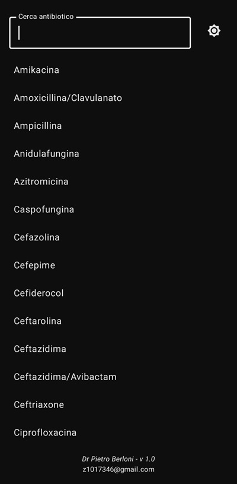
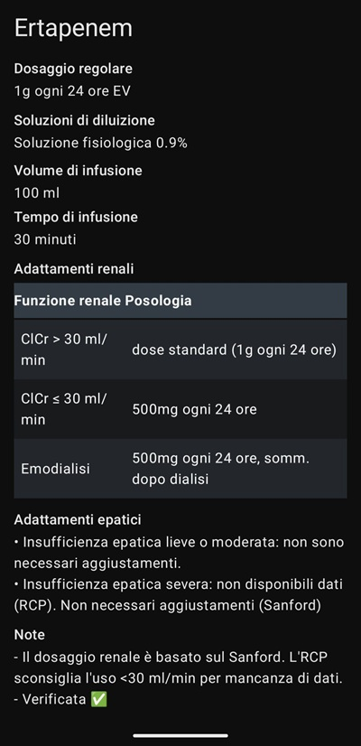

# Antibiotic Helper

App creata per aiutare i medici nella prescrizione degli antibiotici in ambito ospedaliero.\
 \
Si può scegliere il tema chiaro o scuro indipendentemente dal tema del dispositivo.

## Fonti
Le informazioni sono prese dalle sched tecniche dei farmaci (RCP) e dalla guida Sanford per la gestione delle infezioni.\
La dicitura `Verificata ✅` indica che ho personalemnte controllato le informazioni (o almeno ci ho provato). Se non c'è vuol dire che le informazioni riportate sono state generate da ChatGPT.\
In entrambi i casi ricontrollate sempre le infromazioni prima di prescrivere una terapia!\
 
Se riscontrate errori o avete suggerimenti scrivete a z1017346@gmail.com
 
Buon lavoro!
